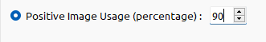
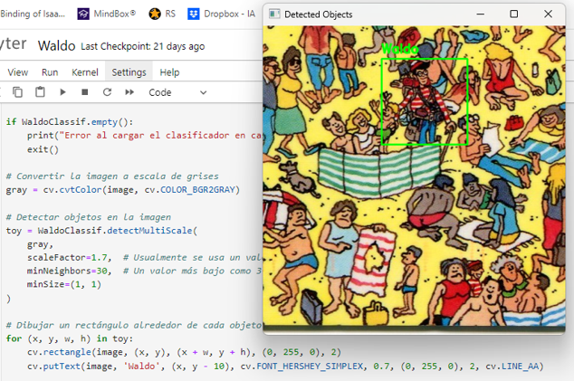

# 
 Proyecto reconocer a Wally 

En este proyecto se trata de entrenar y crear un archivo .xml de entrenamiento en cascada apoyandonos de la herramienta __Cascade Trainer__ para lo cual necesitamos crear un dataSet.

## Crear dataSet

Se necesita organizarlo en dos carpetas __p__ y __n__, poniendo las imagenes positivas en "p" y negativas en "n", para crear las imagenes negativas solo hice recortes en imagenes de escenarios donde se tiene que buscar a Wally, en mi caso hice 600 imagenes, para las imagenes positivas utilice solamente 3 imagenes diferentes las cuales procese para poder obtener un número de imagenes, en total 620, una de las primeras cosas que hice fue hacer que la imagen rotara, para esto me ayude del siguiente código:
### Librerías:
~~~
from PIL import Image, ImageOps, ImageEnhance
import numpy as np
import os
import hashlib
~~~

### Código:
~~~
def rotate_images(input_folder, output_folder, step=2):
    # Crear la carpeta de salida si no existe
    os.makedirs(output_folder, exist_ok=True)

    # Procesar cada imagen en la carpeta de entrada
    for filename in os.listdir(input_folder):
        if filename.endswith('.jpg') or filename.endswith('.png'):
            image_path = os.path.join(input_folder, filename)
            original_image = Image.open(image_path)

            # Rotar la imagen en incrementos de 2 grados hasta 360 grados
            for angle in range(0, 360, step):
                # Rotar la imagen y rellenar el fondo con blanco
                rotated_image = original_image.rotate(angle, expand=True, fillcolor=(255, 255, 255))
                # Guardar la imagen rotada en la carpeta de salida
                rotated_image.save(os.path.join(output_folder, f'{os.path.splitext(filename)[0]}_rotated_{angle}.jpg'))

    print("Proceso terminado")

# Carpetas de entrada y salida
input_folder = 'C:\\Users\\israe\\Desktop\\WaldoAhoraSi\\'
output_folder = 'C:\\Users\\israe\\Desktop\\WaldoAhoraSi\\p\\'

# Aplicar la rotación a todas las imágenes en la carpeta de entrada
rotate_images(input_folder, output_folder)
~~~

Lo que hice fue rotarla solamente 2 grados hasta dar la vuelta completa hasta llegar a los 358 grados obteniendo de esta forma 180 imagenes con la original, esto con las 3.
Lo segundo que hice fue utilizar un efecto espejo en algunas fotos para que así contara como una diferente, utilice el siguiente código:

### Librerías:
~~~
from PIL import Image, ImageOps
import os
~~~

### Código:
~~~
def mirror_images(input_folder, output_folder):
    # Crear la carpeta de salida si no existe
    os.makedirs(output_folder, exist_ok=True)

    # Procesar cada imagen en la carpeta de entrada
    for filename in os.listdir(input_folder):
        if filename.endswith('.jpg') or filename.endswith('.png'):
            image_path = os.path.join(input_folder, filename)
            original_image = Image.open(image_path)

            # Aplicar el efecto espejo horizontal
            mirrored_image = ImageOps.mirror(original_image)

            # Guardar la imagen espejada en la carpeta de salida
            mirrored_image.save(os.path.join(output_folder, f'mirrored_{filename}'))

    print("Proceso terminado")

# Carpetas de entrada y salida
input_folder = 'C:\\Users\\israe\\Desktop\\WaldoAhoraSi\\p\\'
output_folder = 'C:\\Users\\israe\\Desktop\\WaldoAhoraSi\\p\\'

# Aplicar el efecto espejo a todas las imágenes en la carpeta de entrada
mirror_images(input_folder, output_folder)
~~~

Por ultimo lo que hice fue redimencionar las imagenes a un tamaño de 50x50 ayudandome con lo siguiente:

### Librerías:
~~~
import cv2 as cv
import os
~~~

### Código:
~~~
# Directorio de entrada donde se encuentran las imágenes originales
input_dir = 'C:\\Users\\israe\\Desktop)\\Waldo\\n'

# Directorio de salida donde se guardarán las imágenes redimensionadas
output_dir = 'C:\\Users\\israe\\Desktop)\\Waldo\\n'
os.makedirs(output_dir, exist_ok=True)

# Lista de archivos en el directorio de entrada
file_list = os.listdir(input_dir)

# Contador para el nombre de los archivos de salida
output_count = 0
cont = 1

# Iterar sobre los archivos en el directorio de entrada
for i, filename in enumerate(file_list):
    # Solo procesa 1 de cada 6 imágenes
    if i % 1 == 0:
        # Ruta completa de la imagen de entrada
        input_path = os.path.join(input_dir, filename)
        # Lee la imagen
        image = cv.imread(input_path)
        if image is not None:
            # Redimensiona la imagen a 21x28
            resized_image = cv.resize(image, (50, 50))
            # Ruta completa de la imagen de salida
            output_path = os.path.join(output_dir, f'neg_{cont}.jpg')
            # Guarda la imagen redimensionada en el directorio de salida
            cv.imwrite(output_path, resized_image)
            output_count += 1
            cont += 1

print("Proceso completado.")
~~~

Y es todo lo usado para la creación del dataSet, solo hay que usar el Cascade Trainer poniendo la ruta de la carpeta del dataSet, a mi me daba un error a la hora de procesar las imagenes positivas pero lo solucione limitando el uso de las imagenes positivas y solamente usara el 90% de ellas.

Esto te generara un archivo __cascade.xml__ que se podrá usar para reconocer a Wally, ahora solo tendríamos que probarlo.

## Probando archivo xml

Para lograr probar el archivo generado en el paso anterior lo que hice fue un código que cargara una imagen y la analizara haciendo predicciones y pintando un cuadro verde con el titulo "Waldo" en los objetos que logrará reconocer por medio del archivo cascade.xml, el código es el siguiente:

### Librerías:
~~~
import cv2 as cv
~~~

### Código:
~~~
# Cargar la imagen desde el disco
image_path = 'C:\\Users\\israe\\Desktop\\newQ\\Pruebas\\p3.2.jpg'
image = cv.imread(image_path)

# Verificar si la imagen se cargó correctamente
if image is None:
    print("Error al cargar la imagen")
    exit()

# Cargar el clasificador en cascada
cascade_path = 'C:\\Users\\israe\\Desktop\\Si\\classifier\\cascade.xml'
WaldoClassif = cv.CascadeClassifier(cascade_path)

if WaldoClassif.empty():
    print("Error al cargar el clasificador en cascada")
    exit()

# Convertir la imagen a escala de grises
gray = cv.cvtColor(image, cv.COLOR_BGR2GRAY)

# Detectar objetos en la imagen
toy = WaldoClassif.detectMultiScale(
    gray,
    scaleFactor=1.1, 
    minNeighbors=150, 
    minSize=(5, 5)
)

# Dibujar un rectángulo alrededor de cada objeto detectado
for (x, y, w, h) in toy:
    cv.rectangle(image, (x, y), (x + w, y + h), (0, 255, 0), 2)
    cv.putText(image, 'Waldo', (x, y - 10), cv.FONT_HERSHEY_SIMPLEX, 0.7, (0, 255, 0), 2, cv.LINE_AA)

# Redimensionar la imagen
scale_percent = 80  # Cambia este valor para redimensionar según el porcentaje deseado
width = int(image.shape[1] * scale_percent / 100)
height = int(image.shape[0] * scale_percent / 100)
dim = (width, height)
resized_image = cv.resize(image, dim, interpolation=cv.INTER_AREA)

# Mostrar la imagen redimensionada con los objetos detectados
cv.imshow('Detected Objects', resized_image)

# Esperar a que se presione una tecla y cerrar la ventana
cv.waitKey(0)
cv.destroyAllWindows()
~~~

El código aparte de cargar la imagen y hacer el análisis a la hora de mostrar la imagen de salida pero agregue una parte que reduce el tamaño ya que en ocasiones la imagen de salida era demasiado grande y así se lograba apreciar de mejor forma.
Lo importante de este código y lo que ayuda a la detección es ir moviendo los valores de algunas variables a la hora de detectar que es la siguiente:
~~~
toy = WaldoClassif.detectMultiScale(
    gray,
    scaleFactor=1.1, 
    minNeighbors=150, 
    minSize=(5, 5)
)
~~~
Yo al momento de realizar iba moviendo scaleFactor, minNeighbors y minSize, es necesario ir probando varias combinaciones con las 3 variables, pondré un ejemplo de detección de wally y la combinación de variables que use en ese caso:

[Link](https://drive.google.com/drive/folders/1Wa-xM8I4SPWOjA7cmB2fMzPxyUnIIP6e?usp=sharing) de la carpeta en Drive que contiene el dataSet y lo resultante del entrenamiento
